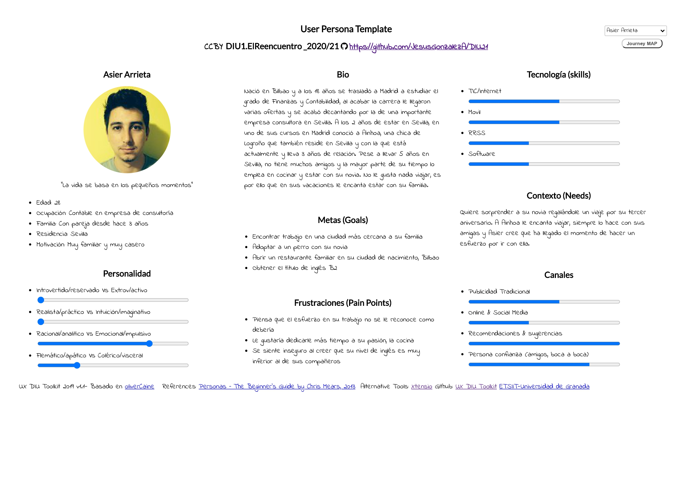
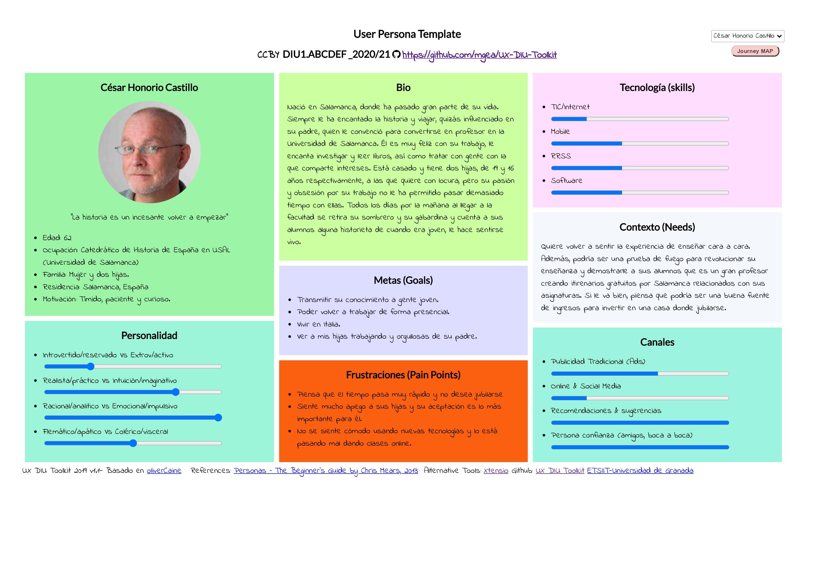
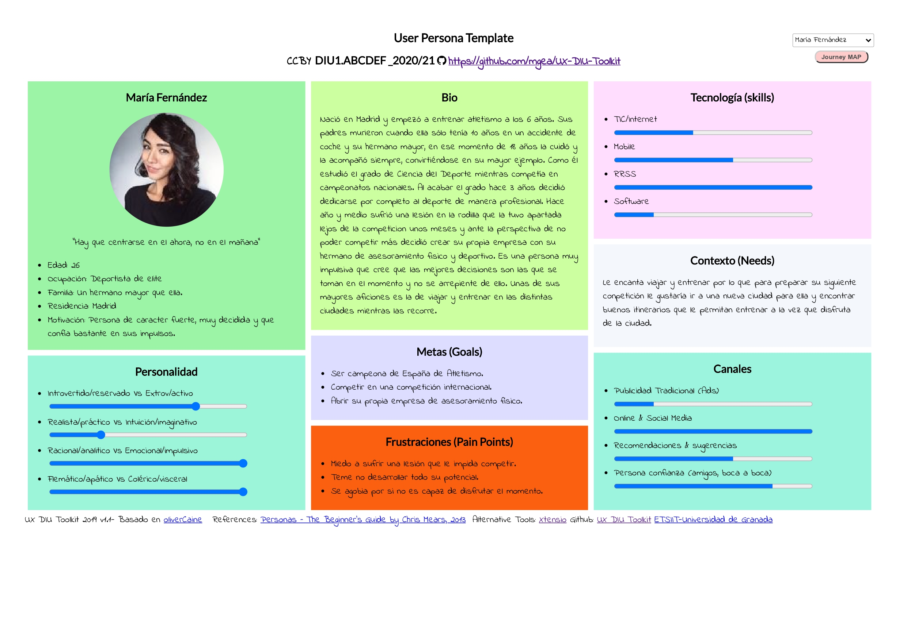
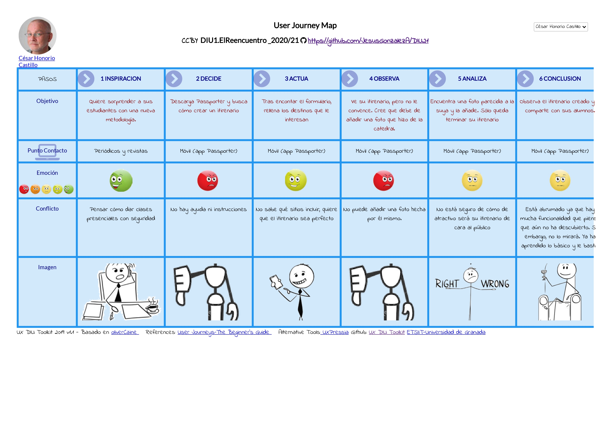
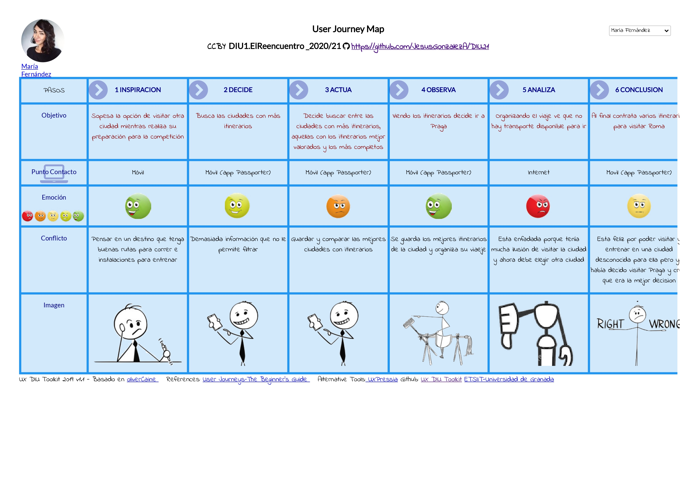

## DIU - Practica1, entregables

### Competitive Analysis

**[Passporter](https://passporterapp.com/)**
Se trata de una aplicación multiplataforma que revoluciona el concepto de viajar. El usuario puede contratar 
itirenarios, creados por otros viajeros. Así, podrá disfrutar de una experiencia turística más real y acompañado,
de forma que podrá descubrir lugares únicos y que se escapan de los destinos turísticos que proponen grandes 
agencias. Posteriormente podrá votarlo y recomendarlo, así como subir fotos de su itirenario para ayudar a otros
usuarios a decantarse por seguir sus pasos.

**[Tripit](https://www.tripit.com/web)**
Esta aplicación multiplataforma permite recopilar toda la información relacionada con un viaje con el objetivo de tener organizado un itinerario completo del mismo.
A diferencia del resto de aplicaciones analizadas, Tripit no está enfocada a ofrecer facilidades al usuario a la hora de contratar una actividad, reservar un alojamiento o contratar un determinado transporte, sino que Tripit nos va a permitir almacenar toda aquella información relativa a contrataciones y reservas que ya hayamos realizado con anterioridad relacionada con el viaje en cuestión, con el objetivo de tener todo ordenado.

**[Sygic Travel](https://www.sygic.com/es/travel)** 
Es una aplicación multiplataforma que nos permite la personificación de un viaje. Nos muestra todo tipo de información sobre la ciudad y permite al usuario la elección de los lugares a visitar y las actividades a realizar con reseñas y valoraciones de otros usuarios para poder seleccionar las mejores.
Además permite el alquiler de vehículos para poder desplazarse y la reserva de hoteles para la estancia. 

**[CheckMyTrip](https://www.checkmytrip.com/cmtweb/#/home)** 
Se trata de una aplicación multiplataforma, que permite al viajero organizar con anticipación las actividades, 
transportes y alojamientos relativos a su próxima nueva aventura. Trabaja con empresas ajenas que ofrecen estos
 servicios, por lo que el usuario encuentra en un mismo lugar todo lo necesario para hacer una escapada.

| Variables \ Empresas  | Passporter |  Tripit  | Sygic Travel  | CheckMyTrip |
| --------------------  |:----------:|:--------:|:-------------:|:-----------:|
| Anuncios              |     ❌     |    ❌   |      ❌       |     ✔️     |
| Mapas                 |     ✔️     |    ✔️   |      ✔️       |     ✔️     |
| App                   |     ✔️     |    ✔️   |      ✔️       |     ✔️     |
| Multiplataforma       |     ✔️     |    ✔️   |      ✔️       |     ✔️     |
| Historial de viajes   |     ✔️     |    ✔️   |      ✔️       |     ✔️     |
| Climatología          |     ❌     |    ❌   |      ✔️       |     ✔️     |
| Reservar alojamiento  |     ❌     |    ❌   |      ❌       |     ❌     |
| Contratar actividades |     ✔️     |    ❌   |      ✔️       |     ✔️     |
| Contratar transportes |     ❌     |    ❌   |      ✔️       |     ✔️     |
| Valorar actividades   |     ✔️     |    ❌   |      ❌       |     ❌     |
| Gratuita              |     ✔️     |    ✔️   |      ✔️       |     ✔️     |
| Opción de pago        |     ✔️     |    ❌   |      ✔️       |     ❌     |
| Video 3D 360  grados sitios más importantes       |      ❌      |    ❌    |      ✔️      |      ❌     |
| Información sobre seguridad                       |      ❌      |    ✔️    |      ❌      |      ❌     |

#### Justificación elección de Passporter
Nos hemos decantado por la aplicación Passporter porque es una aplicación que ofrece una experiencia más real 
del turismo y favorece a comercios más tradicionales, que se han visto más perjudicados por la situación de 
pandemia que vivimos. Además, permite a personas que vivían de realizar visitas guiadas volver a disponer de una 
oportunidad para trabajar. 

### Personas

#### Asier Arrieta
En primer lugar hemos creado a Asier, un chico joven muy introvertido, con unas capacidades limitadas en el uso de aplicaciones móviles y muy reticente a salir de su zona de comfort. Asier cree que puede ser buena idea usar la app Passporter para hacerle un regalo a su novia.

#### César Honorio
También hemos creado a César, un profesor de universidad que quiere acercarse a sus alumnos innovando en su metodología docente. Piensa que Passporter puede ayudarle a enseñar a sus alumnos y a jóvenes de una forma más dinámica en estos tiempos de pandemia.

#### María Fernández
Finalmente, hemos creado a María, una persona muy extrovertida que está acostumbrada a usar redes sociales y aplicaciones móviles y cuyo fin es buscar rutas para viajar y entrenar a la vez.

---

### User Journey Map

#### Asier Arrieta
**Adquirir un itinerario.**

Asier nunca ha viajado, al contrario que su pareja Ainhoa. Hace un mes cumplieron 3 años de novios, por lo que Asier quiere sorprenderle regalándole una experiencia vinculada a una de sus pasiones, viajar.  Es por ello que quiere hacer uso de Passporter, con el objetivo de compensar su inseguridad, adquiriendo un itinerario ya preparado por alguien con mucha más experiencia en el tema de los viajes.

#### César Honorio
**Crear una ruta.**

César es una persona tímida con respecto a la tecnología. Prefiere atender a medios tradicionales y la comunicación boca a boca. Últimamente se siente muy frustrado por cómo la pandemia ha afectado a su metodología docente, hasta que descubre en un periódico la app de Passporter [(ver la noticia aquí)](https://www.larazon.es/viajes/20200628/ubnlbv74afcipb7ctzqchuy45a.html). Se decanta por crear un itirenario para enseñar a sus alumnos la historia a pie de calle y, quizás en un futuro, poder ganar un ingreso extra.

#### María Fernández
**Entrenar y viajar**

La historia trata sobre cómo María utiliza la aplicación para encontrar las ciudades con mejores itinerarios 
para visitar a la vez que entrenar, a pesar la falta de recursos de la aplicación para organizar su viaje.

### Revisión de usabilidad:
- [Enlace al documento](https://github.com/JesusGonzalezA/DIU21/tree/master/P1/Usability-review.xlsx)
- Valoración final: 75
- Comentario sobre la valoración: la aplicación tiene un gran rendimiento y un diseño atractivo. Sin embargo, carece de ayuda para usuarios más novatos.

### (valoración y conclusiones de esta etapa)

### Tabla

|Usability review| | | | | |
|:----|:----|:----|:----|:----|:----|
| | | | | | |
|Passporter| | |Score| |Comments|
| | | | | | |
| |Hover over a guideline for more information, examples of good practice and importance to the overall user experience.| |N/A = not applicable or can't be assessed| |Optional - Provide a short rational for the score, such as a description of the issues found; examples of good practice and the likely impact for users.|
| | | | | | |
|Features & functionality| | | | | |
| | | | | | |
|1|Features and functionality meet common user goals and objectives.| |Good| |El usuario puede contratar su alojamiento y adquirir itinerarios acorde a sus necesidades.|
| | | | | | |
|2|Features and functionality support users desired workflows.| |Excellent| |Sigue la regla de los 3 pasos, es decir, puedes llevar a cabo cualquier función en la aplicación con únicamente 3 pasos.|
| | | | | | |
|3|Frequently-used tasks are readily available (e.g. easily accessible from the homepage) and well supported (e.g. short cuts are available).| |Excellent| |La información relevante está fácilmente accesible en la aplicación.|
| | | | | | |
|4|Users are adequately supported according to their level of expertise (e.g. short cuts for expert users, help and instructions for novice users).| |Very poor| |No hay ningún tipo de instrucciones ni atajos.|
| | | | | | |
|5|Call to actions (e.g. register, add to basket, submit) are clear, well labelled and appear clickable.| |Moderate| |No tienen label y las acciones pueden llegar a crear confusión pues no están muy detalladas.|
| | | | | | |
|Homepage / starting page| | | | | |
| | | | | | |
|6|The Homepage / starting page provides a clear snapshot and overview of the content, features and functionality available.| |Excellent| |Las funcionalidades principales están muy claras y ofrecen información clara y concisa para su uso.|
| | | | | | |
|7|The home page / starting page is effective in orienting and directing users to their desired information and tasks.| |Excellent| |Diferencia muy bien entre los itinerarios del usuario, los de los otros usarios y las búsquedas personalizadas.|
| | | | | | |
|8|The homepage / starting page layout is clear and uncluttered with sufficient 'white space'.| |Moderate| |En general ofrece una muy buena página de inicio, pero cuando un usuario no tiene itinerarios aparece un espacio que no puede ser aprovechado por otras funcionalidades de la app.|
| | | | | | |
|Navigation| | | | | |
| | | | | | |
|9|Users can easily access the site or application (e.g. the URL is predictable and is returned by search engines).| |Excellent| |Tanto la aplicación como su página web es muy fácilmente accesible, así como los enlaces que hay en la misma.|
| | | | | | |
|10|The navigational scheme (e.g. menu) is easy to find, intuitive and consistent.| |Poor| |Es fácil de encontrar pero no existen etiquetas sobre el significado de cada símbolo y no admite movimiento en la interfaz deslizando.|
| | | | | | |
|11|The navigation has sufficient flexibility to allow users to navigate by their desired means (e.g. searching, browse by type, browse by name, most recent etc…). | |Excellent| |Permite filtrar adecuadamente en las búsquedas.|
| | | | | | |
|12|The site or application structure is clear, easily understood and addresses common user goals.| |Good| | |
| | | | | | |
|13|Links are clear, descriptive and and well labelled.| |Good| | |
| | | | | | |
|14|Browser standard functions (e.g. 'back', 'forward', 'bookmark') are supported.| |Excellent| |Tanto en la aplicación como en la página web están bien soportadas.|
| | | | | | |
|15|The current location is clearly indicated (e.g. breadcrumb, highlighted menu item).| |Moderate| |La ubicación actual está clara pero la dirección relativa no, cuesta saber en que punto estamos una vez hemos accedido a algunas funcionalidades.|
| | | | | | |
|16|Users can easily get back to the homepage or a relevant start point.| |Excellent| | |
| | | | | | |
|17|A clear and well structure site map or index is provided (where necessary).| |Very poor| |No existe ningún índice.|
| | | | | | |
|Search| | | | | |
| | | | | | |
|18|A consitent, easy to find and easy to use search function is available throughout (where desirable).| |Excellent| | |
| | | | | | |
|19|The search interface is appropriate to meet user goals (e.g. multi-parameter, prioritised results, filtering search results).| |Excellent| | |
| | | | | | |
|20|The search facility deals well with common searchs (e.g. showing most popular results), misspellings and abbreviations.| |Very poor| |Al buscar un itinerario en la ciudad de Sevilla, escribimos Sebilla, y autómaticamente nos mostró información de itinerarios en Ciudad Real.|
| | | | | | |
|21|Search results are relevant, comprehensive, precise, and well displayed.| |Moderate| |Falta precisión.|
| | | | | | |
|Control & feedback| | | | | |
| | | | | | |
|22|Prompt and appropriate feedback is given (e.g. following a successful or unsuccessful action).| |Poor| |No existe feedback a la hora de llevar a cabo acciones importantes como crear un itinerario.|
| | | | | | |
|23|Users can easily undo, go back and change or cancel actions; or are at least given the chance to confirm an action before commiting (e.g. before placing an order).| |Poor| |Es difícil deshacer acciones tales como crear un itinerario, sin dar opciones como volver hacia atrás.|
| | | | | | |
|24|Users can easily give feedback (e.g. via email or an online feedback / contact us form).| |Poor| |Se puede dar vía email, pero es muy difícil de encontrar.|
| | | | | | |
|Forms| | | | | |
| | | | | | |
|25|Complex forms and processes are broken up into readily understood steps and sections. Where a process is used a progress indicator is present with clear numbers or named stages.| |Good| |Al crear un itinerario se indica un porcentaje referente al contenido añadido.|
| | | | | | |
|26|A minimal amount of information is requested and where required justification is given for asking for information (e.g. date of birth, telephone number).| |Good| |Únicamente pide datos tales como nombre, nombre de usuario, correo y dirección.|
| | | | | | |
|27|Required and optional form fields are clearly indicated.| |Excellent| | |
| | | | | | |
|28|Appropriate input fields (e.g. calendar for date selection, drop down for selection) are used and required formats are indicated.| |Excellent| | |
| | | | | | |
|29|Help and instructions (e.g. examples, information required) are provided where necessary.| |Very poor| |No hemos encontrado nada relaccionado con ayuda o asistencia para el uso de la app.|
| | | | | | |
|Errors| | | | | |
| | | | | | |
|30|Errors are clear, easily identifiable and appear in appropriate location (e.g. adjacent to data entry field, adjacent to form, etc.).| |Good| | |
| | | | | | |
|31|Error messages are concise, written in easy to understand language and describe what's occurred and what action is necessary.| |Good| |No especificaba la acción a realizar para solucionar el problema.|
| | | | | | |
|32|Common user errors (e.g. missing fields, invalid formats, invalid selections) have been taken into consideration and where possible prevented.| |Good| | |
| | | | | | |
|33|Users are able to easily recover (i.e. not have to start again) from errors.| |Very poor| | |
| | | | | | |
|Content & text| | | | | |
| | | | | | |
|34|Content available (e.g. text, images, video) is appropriate and sufficiently relevant, and detailed to meet user goals.| |Excellent| | |
| | | | | | |
|35|Links to other useful and relevant content (e.g. related pages or external websites) are available and shown in context.| |Excellent| | |
| | | | | | |
|36|Language, terminology and tone used is appropriate and readily understood by the target audience.| |Excellent| | |
| | | | | | |
|37|Terms, language and tone used are consitent (e.g. the same term is used throughout).| |Excellent| | |
| | | | | | |
|38|Text and content is legible and scanable, with good typography and visual contrast.| |Good| |Por regla general sí, pero tiene algunos errores de layout.|
| | | | | | |
|Help| | | | | |
| | | | | | |
|39|Online help is provided and is suitable for the user base (e.g. is written in easy to understand langugage and only uses recognised terms). Where appropriate contextual help is provided.| |Very poor| | |
| | | | | | |
|40|Online help is concise, easy to read and written in easy to understand language.| |Very poor| | |
| | | | | | |
|41|Accessing online help does not impede users (i.e. they can can resume work where they left off after accessing help).| |Very poor| | |
| | | | | | |
|42|Users can easily get further help (e.g. telephone or email address).| |Moderate| |Se puede pedir ayuda por email.|
| | | | | | |
|Performance| | | | | |
| | | | | | |
|43|Site or application performance doesn't inhibit the user experience (e.g. slow page downloads, long delays).| |Excellent| | |
| | | | | | |
|44|Errors and reliabilty issues don't inhibit the user experience.| |Excellent| | |
| | | | | | |
|45|Possible user configurations (e.g. browsers, resolutions, computer specs) are supported.| |Excellent| |Nos pareció curioso que el diseño de la propia interfaz se adaptara al tono del dispositivo (claro o oscuro).|
| | | | | | |
|Overall usability score (out of 100) *| | |75|-|Good|
| | | | | | |
|* Very poor (less than 29) - Users are likely to experience very significant difficulties using this site or system and might not be able to complete a significant number of important tasks.| | | | | |
|* Poor (between 29 and 49) - Users are likely to experience some difficulties using this site or system and might not be able to complete some important tasks.| | | | | |
|* Moderate (between 49 and 69) - Users should be able to use this site or system and complete most important tasks, however the user experience could be significantly improved.| | | | | |
|* Good (between 69 and 89) - Users should be able to use this site or system with relative ease and should be able to complete the vast majority of important tasks.| | | | | |
|* Excellent (more than 89) - This site or system provides an excellent user experience for users. Users should be able to complete all important tasks on the site or system.| | | | | |

