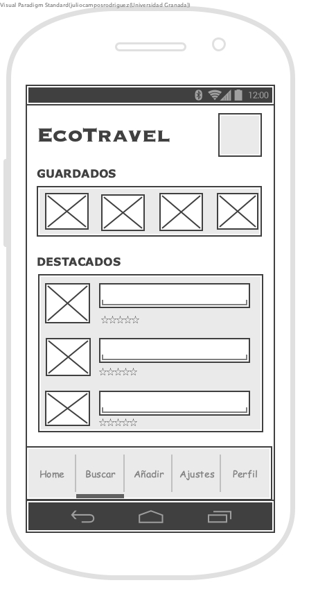

## DIU - Practica2, entregables

### Ideación 

**Malla receptora de información**
Hemos elegido utilizar esta herramienta porque nos permite descubrir los puntos fuertes 
de la aplicación y en qué se debe mejorar o qué se debe añadir para dar solución a las
necesidades de los usuarios y las preguntas que se hacen al utilizar la app.

### PROPUESTA DE VALOR

**Descripción:** nuestro proyecto consiste en una aplicación que busca ofrecer una alternativa
a aquellas personas que desean viajar respetando la naturaleza y descubriendo lugares y comercios
rurales y que respeten la tradición, productos y lugares. Pretende crear una comunidad de usuarios
y comercios/servicios que sigan estos valores y principios y conectarlos.

### TASK ANALYSIS

**User Task Matrix** 
Hemos decidido elegir esta herramienta para definir correctamente a los grupos de usuarios en los que nos
vamos a centrar y la funcionalidad que le vamos a ofrecer.

### ARQUITECTURA DE INFORMACIÓN

* Sitemap 

* Labelling

| Label | Siginificado |
| -- | -- |
| Login | Inicio de sesión / Registro  de usuraio en la aplicación |
| Home | Página principal de la aplicación. Resumen de los posts y navegación completa |
| Search | Página de búsqueda de comercios, actividades, lugares... |
| Settings | Página para configurar los ajustes de la aplicación |
| Form | Página de formulario con la cual podemos añadir un nuevo comercio, una nueva actividad o nuevos productos a un comercio existente  |
| User | Página de perfil de usuario de la aplicación. En ella el usuario será capaz de modificar y ver su perfil de la aplicación|
| Notificaciones | Página que nos muestra las últimas notificaciones que recibe un usuario |
| Comercio | Página que nos muestra toda la información necesaria de un comercio registrado en nuestra aplicación |
| Ubicación | Página que nos muestra los comercios y actividades que se realizan en la ubicación buscada por el usuario  |
| Producto | Página que muestra el resumen de un producto que vende el comercio. Contiene información dada por el dueño del mismo y comentarios de los usuarios acerca del mismo, si los hubiere |
| Map | Página externa. Mapa que muestra la ubicación del comercio |
| Post | Publicaciones realizadas por el comercio y por los usuarios sobre el mismo. |
| Contact | Correo/Marcador de teléfono móvil propios del dispositivo |
| Gallery | Página que muestra una galería de fotos subidas por el comercio y por los usuarios sobre el mismo |
| Upload | Formulario para subir un nuevo post |

### Prototipo Lo-FI Wireframe
En el siguiente Wireframe tratamos de representar en forma de boceto la pantalla de inicio que se verá nada más acceder a la app. 

A continuación se muestra el Wireframe referente a la pantalla que verá el usuario cuando quiera añadir una actividad, establecimiento, etc.

El siguiente Wireframe tratará de representar la pantalla que observa el usuario cuando selecciona una actividad para conocer más detalle sobre la misma.

Por último, con este Wireframe tratamos de presentar la pantalla con la que se encuentra un usuario cuando va a llevar a cabo una búsqueda de una actividad concreta.

### Conclusiones  
Hacer uso de la malla receptora de información diseñada en esta etapa, aunque pueda parecer algo completamente diferente al resto de apartados que se llevan a cabo en esta práctica, nos ha ayudado bastante de cara a plantear nuestra idea de aplicación, intentando aprovechar los puntos fuertes de Passporter y mejorar sus puntos débiles. Posteriormente, la propuesta de valor nos ha ayudado a definir de una manera clara nuestros propósitos, al igual que la matriz de tareas que ha sido capaz de hacernos identificar de una manera más fácil las operaciones, y el grupo de usuarios que van a hacer uso de nuestro sistema.
Para finalizar, nos gustaría destacar lo útil que nos ha sido desarrollar el Sitemap justo antes de ponernos con el diseño de los Wireframe.
