# DIU - Practica 3, entregables

## Moodboard (diseño visual + logotipo) 

[Puede verlo aquí](https://app.milanote.com/1LzAjP1dWddM2U?p=49ycxkzUwlo)
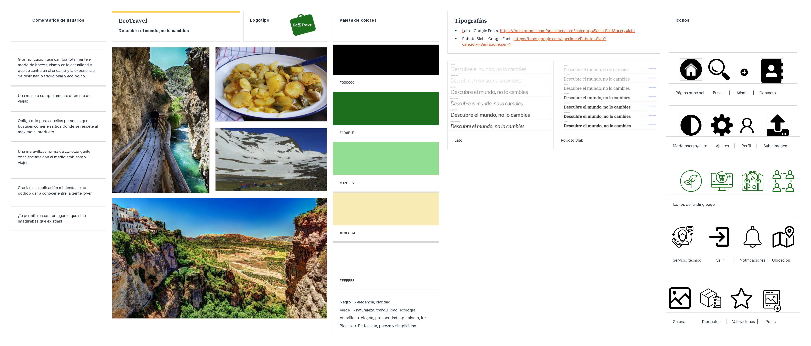

### Imágenes inspiradoras

Hemos escogido estas imágenes porque nos transmiten tradición, calidez y nos transportan a "casa". Además, todas comparten algo, y es que gracias a respetar la naturaleza y lo local podemos vivir grandes expMoeriencias. Nosotros con este proyecto queremos concienciar a la gente de la importancia de cuidar lo que se nos ha dado y que podamos luchar por seguir manteniéndolo y disfrutando de ello.

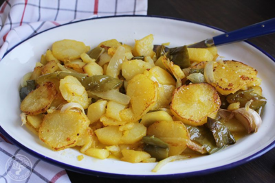
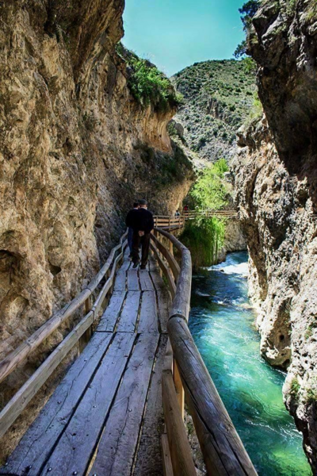

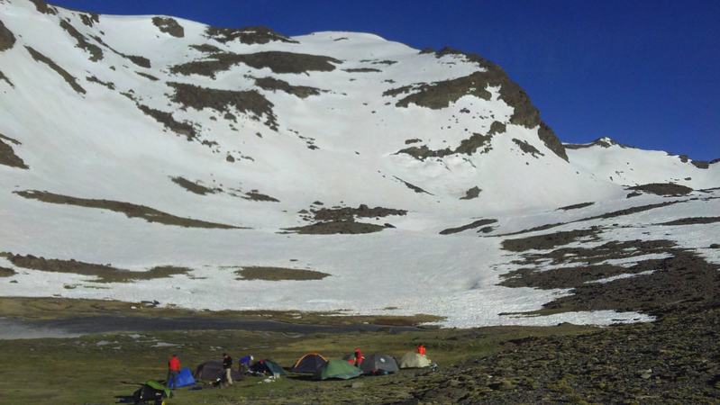

### Paleta de colores

Lo que queremos transmitir nos ha condicionado mucho a la hora de escoger la paleta de colores.

* Negro ( #000000 ): transmite elegancia y claridad.

* Verde ( #1D6F1E y #008A00 ): transmite  naturaleza, tranquilidad, ecología.

* Amarillo ( #F8ECB4 ): transmite  alegría, prosperidad, optimismo, luz.

* Blanco ( #FFFFFF ): transmite perfección, pureza y simplicidad .

#### Test de contraste
[Herramienta utilizada](https://github.com/dequelabs/color-palette)

Hemos realizado un test de contraste de la paleta utilizada, y como podemos comprobar es correcta exceptuando el caso en el que se utiliza el color amarillo de fondo y el segundo verde como color de la fuente. No utilizaremos esta combinación en nuestros diseños pero mantendremos la paleta escogida utilizando el resto de combinaciones permitidas. 

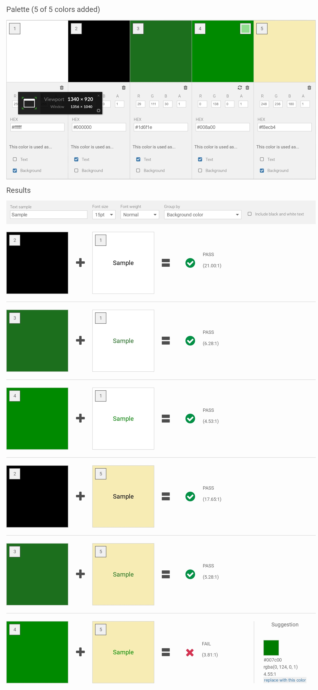

### Tipografía

Hemos elegido dos fuentes distintas: una con serif y otra sin serif. Esto es debido a que en un futuro nos gustaría hacer unas impresiones con el fin de dar físicamente a los locales que trabajen con nosotros un cartel que represente que es un sitio que cumple con los valores que planteamos desde la plataforma y los usuarios de la aplicación valoran mucho el comercio en cuestión.
Estos carteles se verán mejor con una fuente serigrafiada, mientras que para hacer la aplicación utilizaremos una fuente sin serif, puesto que es lo más recomendable para leer desde el ordenador y móvil.

* [Sin serif: Lato](https://fonts.google.com/specimen/Lato?category=Sans+Serif&query=lato)

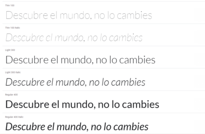

* [Con serif: Roboto Slab](https://fonts.google.com/specimen/Roboto+Slab?category=Serif&authuser=1)

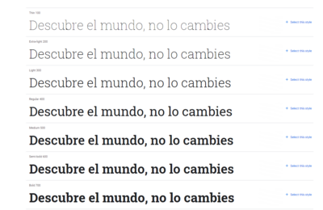

### Comentarios de usuarios

Lo que nos gustaría que los usuarios dijeran de nuestro proyecto:

* Gran aplicación que cambia totalmente el modo de hacer turismo en la actualidad y que se centra en el encanto y la experiencia de disfrutar lo tradicional y ecológico.
* Una manera completamente diferente de viajar.
* Obligatorio para aquellas personas que busquen comer en sitios donde se respete al máximo el producto.
* Una maravillosa forma de conocer gente concienciada con el medio ambiente y viajera.
* Gracias a la aplicación mi tienda se ha podido dar a conocer entre la gente joven
* ¡Te permite encontrar lugares que ni te imaginabas que existían!

### Iconos

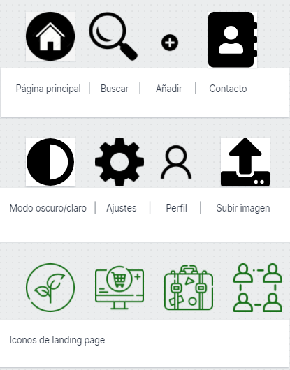
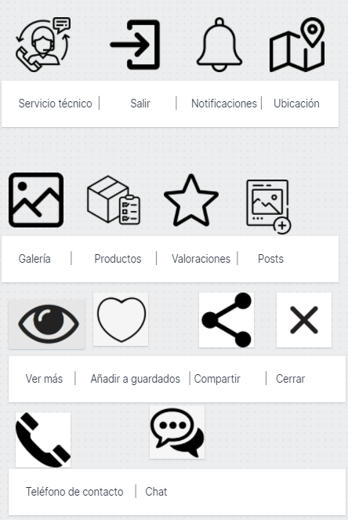

### Logo
El logo tiene el color principal de nuestra app que representa la naturaleza. Queremos que el concepto viaje y cuidar el planeta estén presentes en todos los iconos, es por ello que hemos sustituído la letra 'o' de ecotravel por una bola del mundo y hemos añadido una maleta simbolizando el mensaje de "pensar globalmente, actuar localmente".  

#### Sin símbolos
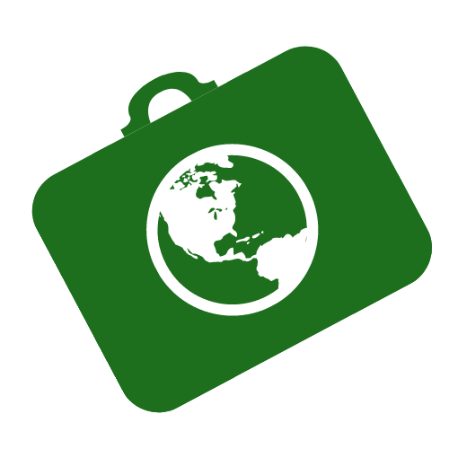

#### B/N
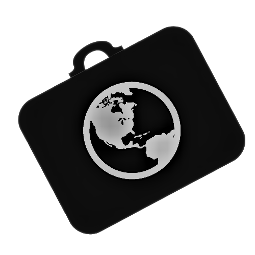

#### Sólo con el nombre

#### 24x24

## Landing Page

Puede ver [aquí](https://xd.adobe.com/view/2db3207e-db00-4f65-9419-5f6cd088a22b-78e0/?fullscreen) la landing page.
Hemos querido mostrar en portada una imagen en la que la naturaleza, la paz y lo rural destaquen y que encaje con nuestra paleta de colores. El Call To Action aparece junto con el título del proyecto y dos frases que ayudan al usuario a entender lo que hacemos y cómo lo hacemos. 
Abajo tenemos lo que podemos ofrecer a los usuarios y algunos comentarios de los mismos. Utilizamos un footer para que se pueda llegar a nuestras redes sociales fácilmente.

## Mockup: LAYOUT HI-FI

Puede ver [aquí](https://xd.adobe.com/view/33c4e3f8-e569-449f-adc6-9f347606e847-6697/?fullscreen) la presentación del diseño.

### Home
Se trata de la página principal de la aplicación. Arriba se muestra un resumen de las actividades guardadas por el usuario y abajo el listado de las actividades destacadas (nota alta en las valoraciones) para que pueda añadirlas y verlas rápidamente.

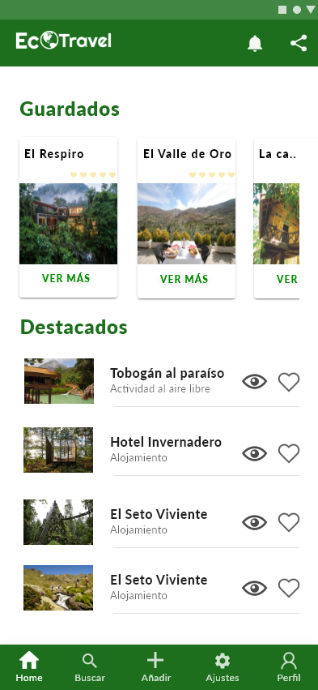

### Añadir una experiencia
Se trata de un formulario dinámico (cambia en función del tipo de experiencia seleccionada). La parte de arriba nos muestra un resumen de los pasos que el usuario debe cumplir para realizar un registro de forma correcta. 

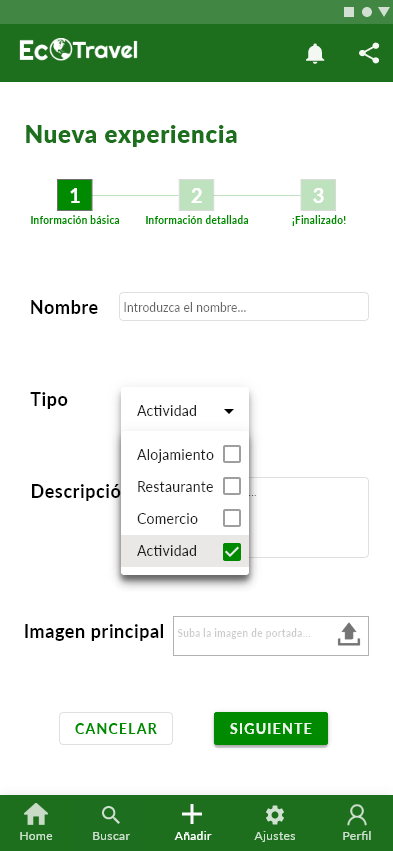

### Buscar una experiencia
Se trata de una página que permite al usuario buscar experiencias, filtrándolas por nombre, tipo y localización. Se muestra abajo un listado con todas las opciones que encajan con ese filtro. El usuario puede guardarlas o pinchar sobre ellas para ver más información (siguiente página).

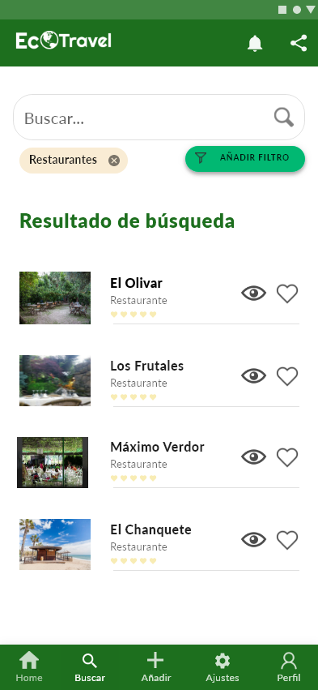

### Detalle de una experiencia (restaurante, excursión, local...)
Se trata de la página que muestra la información completa relacionada con una experiencia. Arriba se muestra un botón para cerrar la página y volver atrás o guardarla si es del gusto del usuario. Todas las experiencias comparten información básica, como título, valoración, tipo de experiencia, descripción, contacto y localización. Esta información, que es la más relevante, aparece al principio. 
Después aparece información adicional, como en este caso el menú del restaurante. 
Por último, aparecen todos los comentarios de los usuarios ecoTravellers acerca de la experiencia.

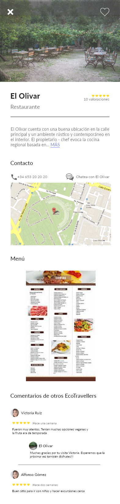

## Guidelines

Hemos utilizado las guías de diseño proporcionadas por Android, debido a que la mayoría de nuestros usuarios utilizarán esta plataforma.

[Guía de patrones de diseño](http://ui-patterns.com/)

[Guía de estilos y componentes: Material Design](https://material.io/)

### Patrones:
* [Auto-sharing](http://ui-patterns.com/patterns/auto-sharing): lo utilizamos para que el usuario pueda compartir sus experiencias con sus redes sociales.
* [Chat](http://ui-patterns.com/patterns/direct-messaging): lo utilizamos para que el usuario pueda interactuar con los creadores de las experiencias individualmente. Ej: un ecotraveller quiere contactar con un restaurante para reservar.
* [Testimonials](http://ui-patterns.com/patterns/testimonials):  lo utilizamos en la landing page para añadir confianza a nuestro producto. 
* [Input Feedback](http://ui-patterns.com/patterns/InputFeedback): lo utilizamos en los formularios de la aplicación, para que el usuario reciba rápidamente un feedback sobre el contenido que introduce y facilitemos el uso de la aplicación. Además, como versión futura, se podría introducir un sistema de recomendación para ayudar a crear mejores experiencias.
* [Settings](http://ui-patterns.com/patterns/settings): lo utilizamos en la aplicación para que el usuario pueda configurarla a su gusto. Permitiremos cambiar (la principal finalidad es cuidar la accesibilidad de la app):
    - Color principal
    - Tamaño de letra. [(Patrón Adaptable View)](http://ui-patterns.com/patterns/AdaptableView)
    - Activar/Desactivar notificaciones
* [Preview](http://ui-patterns.com/patterns/LivePreview): lo utilizamos en el formulario para incluir una experiencia en nuestra aplicación (última fase). No es un live preview, pero si ayuda al usuario a ver cómo quedaría su experiencia antes de publicarla. Podríamos en fases más avanzadas de desarrollo añadir recomendaciones.
* [Undo](http://ui-patterns.com/patterns/undo): lo utilizamos junto con el patrón anterior para que el usuario pueda cancelar la acción y añadir cambios en el formulario para crear una experiencia.
* [Rate Content](http://ui-patterns.com/patterns/RateContent): lo utilizamos en la app para que los usuarios valoren las experiencias y así conseguir que todos los locales, excursiones, restaurantes, etc cumplen con los valores que queremos promover con nuestra solución.
* [Notifications](http://ui-patterns.com/patterns/notifications): lo utilizamos en la app para informar a los usuarios de actualizaciones importantes o mensajes privados (chat).
* [Cards](http://ui-patterns.com/patterns/cards): las utilizamos en la app para mostrar las experiencias y los resultados de las búsquedas de los usuarios. 
* [Continuous Scrolling](http://ui-patterns.com/patterns/ContinuousScrolling): lo utilizamos tanto en la app como en la landing page. 
    - En la landing page lo utilizamos porque añadir una subpágina podría hacernos perder usuarios, debido a que deberían de navegar para poder encontrar contenido. Además queremos tener siempre a mano el botón de descargar, que es nuestro CTA.
    - En la app lo utilizamos en el detalle de una experiencia para mostrar arriba el contenido más relevante y abajo el secundario, pero no tendría sentido separarlo en pantallas distintas. Además, lo utilizamos en las listas como en los resultados de la búsqueda. Esto nos permitirá implementar paginación en el desarrollo sin que el usuario tenga que navegar.
* [Tagging](http://ui-patterns.com/patterns/Tag): lo utilizamos en la app para que el usuario pueda filtrar las búsquedas de experiencias.
* [Favourites](http://ui-patterns.com/patterns/favorites): lo utilizamos en la app para que el usuario pueda guardar experiencias para verlas luego. Aparecen las experiencias guardadas en la pantalla home.

### Componentes:
* [App bar: top](https://material.io/components/app-bars-top): muestra la información de la página actual y las principales acciones.
* [Bottom navigation](https://material.io/components/bottom-navigation): permite al usuario moverse entre las direcciones de primer nivel de la app.
* [Card](https://material.io/components/cards): se utiliza para mostrar contenido y acciones relacionadas con un tema concreto. Podemos añadir imágenes, texto y jerarquizar la información. Lo utilizaremos para mostrar el resumen de las actividades guardadas por el usuario.
* [Lists](https://material.io/components/lists): se utilizan para agrupar elementos como texto, imágenes, cards, etc. Vamos a utilizarlo en la app para mostrar el listado de actividades destacadas. 
* Formularios: para los formularios hemos utilizado algunos componentes proporcionados por la guía:
    * [Checkboxes](https://material.io/components/date-pickers): las utilizamos cuando el usuario debe de seleccionar entre varias opciones. Si sólo hubiera una opción de tipo booleana, utilizaríamos [Switches](https://material.io/components/switches). En el formulario lo hemos utilizado para elegir el tipo de actividad a registrar.
    * [Text fields](https://material.io/components/text-fields): permite al usuario introducir información y recibir feedback al instante de si es correcta o no.
* [Chips](https://material.io/components/chips): permite a los usuarios filtrar contenido. Lo utilizaremos para implementar la búsqueda de actividades.
* [Divider](https://material.io/components/dividers): lo utilizamos para separar la información en componentes según su importancia o temática.

## Documentación: Publicación del Case Study

Para ver el caso de estudio publicado pinche [aquí](https://youtu.be/_eJTgeZffRU)

### Herramientas utilizadas
* [Adobe XD](https://www.adobe.com/products/xd.html): lo hemos utilizado para elaborar los diseños de la landing page y la app. En general nos ha gustado mucho, pero creemos que puede ser más complicada de usar con respecto a otras aplicaciones, como [Figma](https://www.figma.com/).
* [Milanote](https://milanote.com/): lo hemos utilizado para elaborar el Moodboard y nos ha parecido muy útil y fácil de usar.
* [Color-palette](https://github.com/dequelabs/color-palette): nos ha ayudado mucho a comprobar que nuestra paleta era correcta y nos ha sugerido cambios, al comprobar que algunos colores no eran compatibles.
* [Crello](https://crello.com/pro/?gclid=CjwKCAjwnPOEBhA0EiwA609ReeT7VGrsrhXmLrMqHDCbEZxiQZuW6AxG3ZkIXqOlWhaiuRJW_ArtVxoCaKQQAvD_BwE): lo hemos utilizado para realizar el logo y nos ha parecido muy intuitivo.
* [Material Design](https://material.io/): nos ha servido para documentarnos sobre los componentes y cómo utilizarlos en aplicaciones móviles.
* [UI-patterns](http://ui-patterns.com/): nos ha servidor para ver un listado de patrones de diseño y comprobar sus casos de uso y popularidad.
* [Google fonts](https://fonts.google.com/): resulta muy útil buscar fuentes en esta página web porque puedes filtrar por tipos y ver rápidamente cómo quedaría en los diseños.
* [Fontawesome](https://fontawesome.com/): contiene un listado muy amplio de iconos.

### Valoraciones
Con el moodboard hemos hecho un brainstorming que nos ha servido de guía para poder desarrollar nuestras ideas. 

Primero escogimos algunas imágenes que nos servían de inspiración, la mayoría sitios y comidas de nuestro entorno rural más cercano.

Nuestra mayor dificultad surgió al elegir la paleta de colores: queríamos que el color verde estuviera muy presente en la app, para transmitir armonía y cuidado a la naturaleza. Sin embargo, tras hacer los test de contraste de la paleta, algunas combinaciones no eran correctas, por lo que tuvimos que redefinirlo, manteniendo el diseño visual que queríamos desarrollar. Para esto, nos ayudó mucho utilizar la herramienta [color-palette](https://github.com/dequelabs/color-palette).

Posterior a esto decidimos la tipografía. Para ello, indagamos un poco en la psicología de las marcas y analizamos lo que transmitían los distintos tipos de fuentes. Pensamos que para nuestro proyecto era más adecuado utilizar [Lato](https://fonts.google.com/specimen/Lato?category=Sans+Serif&query=lato) y [Roboto Slab](https://fonts.google.com/specimen/Roboto+Slab?category=Serif&authuser=1). 

A continuación, redactamos comentarios de usuarios que nos gustaría escuchar. Para ello nos pusimos en la piel de distintos grupos de usuarios y pensamos de qué forma podría ayudarles nuestro proyecto.

Con todo esto, elaboramos una [landing page](https://xd.adobe.com/view/2db3207e-db00-4f65-9419-5f6cd088a22b-78e0/?fullscreen) que mostrara resumidamente a los potenciales usuarios de la aplicación las ventajas que le ofreceríamos.
Además, creamos el [diseño de la app](https://xd.adobe.com/view/33c4e3f8-e569-449f-adc6-9f347606e847-6697/?fullscreen), siguiendo con las principales guías y patrones de diseño.

