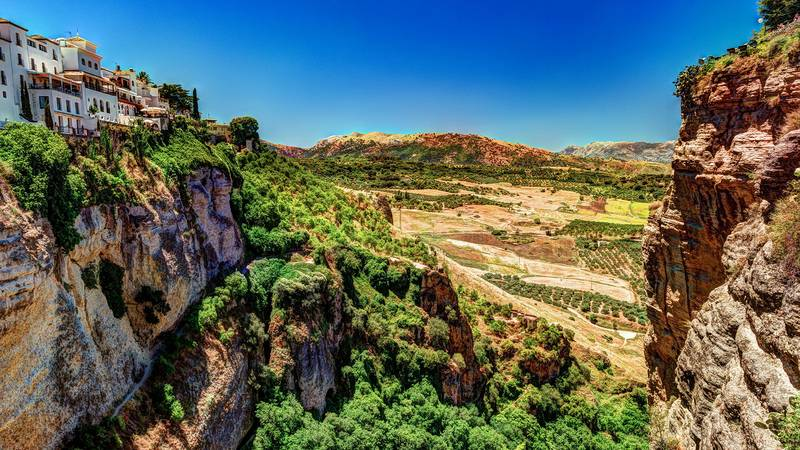

# DIU - Practica 3, entregables

## Moodboard (diseño visual + logotipo) 

### Imágenes inspiradoras

Hemos escogido estas imágenes porque nos transmiten tradición, calidez y nos transportan a "casa". Además, todas comparten algo, y es que gracias a respetar la naturaleza y lo local podemos vivir grandes experiencias. Nosotros con este proyecto queremos concienciar a la gente de la importancia de cuidar lo que se nos ha dado y que podamos luchar por seguir manteniéndolo y disfrutando de ello.

### Paleta de colores

Lo que queremos transmitir nos ha condicionado mucho a la hora de escoger la paleta de colores.

* Verde ( #1D6F1E y #92SSE92 ): transmite  naturaleza, tranquilidad, ecología.

* Amarillo ( #F8ECB4 ): transmite  alegría, prosperidad, optimismo, luz.

* Blanco ( #FFFFFF ): transmite perfección, pureza y simplicidad .

### Tipografía

Hemos elegido dos fuentes distintas: una con serif y otra sin serif. Esto es debido a que en un futuro nos gustaría hacer unas impresiones con el fin de dar físicamente a los locales que trabajen con nosotros un cartel que represente que es un sitio que cumple con los valores que planteamos desde la plataforma y los usuarios de la aplicación valoran mucho el comercio en cuestión.
Estos carteles se verán mejor con una fuente serigrafiada, mientras que para hacer la aplicación utilizaremos una fuente sin serif, puesto que es lo más recomendable para leer desde el ordenador y móvil.

* [Sin serif: Lato](https://fonts.google.com/specimen/Lato?category=Sans+Serif&query=lato)

* [Con serif: Roboto Slab](https://fonts.google.com/specimen/Roboto+Slab?category=Serif&authuser=1)

### Comentarios de usuarios

Lo que nos gustaría que los usuarios dijeran de nuestro proyecto:

* Gran aplicación que cambia totalmente el modo de hacer turismo en la actualidad y que se centra en el encanto y la experiencia de disfrutar lo tradicional y ecológico.
* Una manera completamente diferente de viajar.
* Obligatorio para aquellas personas que busquen comer en sitios donde se respete al máximo el producto.
* Una maravillosa forma de conocer gente concienciada con el medio ambiente y viajera.
* Gracias a la aplicación mi tienda se ha podido dar a conocer entre la gente joven
* ¡Te permite encontrar lugares que ni te imaginabas que existían!

### Iconos

### Logo

### Resumen 

[Puede verlo aquí](https://app.milanote.com/1LzAjP1dWddM2U?p=49ycxkzUwlo)

## Landing Page

## Mockup: LAYOUT HI-FI

## Documentación: Publicación del Case Study

(incluye) Valoración del equipo sobre la realización de esta práctica o los problemas surgidos
 
