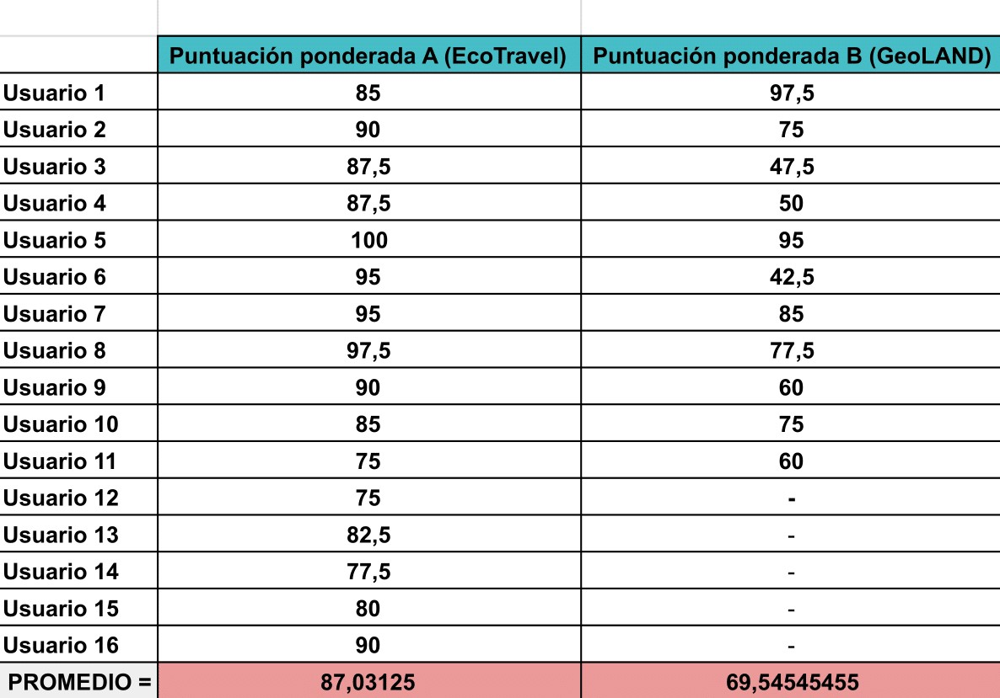

# DIU - Practica 4, entregables

Lista de proyectos (en github) https://github.com/mgea/DIU20/blob/master/P4/proyectos.md

## Proyecto a evaluar

El proyecto a evaluar es [GeoLAND](https://github.com/gonzalodelatorree/DIU21).

Según sus desarrolladores, se trata de una "aplicación desarrollada para que los usuarios puedan gestionar y planificar su visita a la provincia de Granada y Andalucía y así conseguir incentivar el turismo rural y local".

## Cuestionario SUS (System Usability Scale Test)

El cuestionario SUS permite obtener información de los usuarios a partir de escenarios donde prueben la aplicación de forma libre o mediante tareas dirigidas. 
Hemos desarrollado un cuestionario SUS que han rellenado personas reales.

Las respuestas al cuestionario SUS relativo a [GeoLAND](https://github.com/gonzalodelatorree/DIU21) pueden verse [aquí](https://github.com/JesusGonzalezA/DIU21/blob/master/P4/Docs/CuestionarioB.pdf)
Las respuestas al cuestionario SUS relativo a [EcoTravel](https://github.com/jesusgonzaleza/DIU21) pueden verse [aquí](https://github.com/JesusGonzalezA/DIU21/blob/master/P4/Docs/CuestionarioA.pdf)

## A/B Testing

**Puntuación A ([EcoTravel](https://github.com/jesusgonzaleza/DIU21)):** 87.03125
**Puntuación B ([GeoLAND](https://github.com/gonzalodelatorree/DIU21)):** 69.54545

Se considera que aquellas aplicaciones con una puntuación en un test SUS superior a 68 han recibido una buena acogida por parte de los usuarios pero podría mejorar. Una puntuación superior a 80 significa que los usuarios aman la app y que existe una alta posibilidad de que sea recomendada entre usuarios.
Como se puede observar, aunque [EcoTravel](https://github.com/jesusgonzaleza/DIU21) arroja mejores resultados en los cuestionarios realizados que [GeoLAND](https://github.com/gonzalodelatorree/DIU21), ambos han recibido una buena valoración.

## Informe de usabilidad de GeoLAND
Vea toda la información [aquí](https://github.com/JesusGonzalezA/DIU21/blob/master/P4/Docs/P4_UsabReport_B_doneby_ElReencuentro_Wombats.pdf)

El grupo de usuarios que ha respondido al cuestionario, a pesar de no ser representativo, está formado por un conjunto de personas que, potencialmente, usarían la aplicación. Podemos analizar que la aplicación GeoLAND genera una impresión buena, debido a que los usuarios no han encontrado problemas serios utilizando el prototipo de la aplicación. Sin embargo, según los datos que nos brinda el cuestionario no llega a ser lo suficientemente atractiva y se debería pulir algunos aspectos de diseño y usabilidad para que la experiencia de usuario se vea potenciada.

En líneas generales, los usuarios se encuentran abrumados al ver la aplicación, debido a que se percibe muy extensa. Debido a que el diseño es un proceso de refinamiento, encontrarnos con estas críticas al principio nos supone poder reaccionar a tiempo y perfeccionarlo para que encaje bien con las necesidades y preferencias de los usuarios potenciales. Por ejemplo, la inclusión de una barra de navegación podría solventar bien este problema.

Por otro lado, cabe destacar la labor que ha realizado el grupo, elaborando múltiples pantallas que han transmitido muy bien la idea de negocio. Nos ha permitido conocer viendo pocas pantallas del prototipo lo que quieren conseguir con la app y qué funcionalidades pretenden ofrecer. 

## Conclusiones

En cuanto a esta práctica, decir que cuestionarios como este nos son de gran ayuda para refinar nuestros diseños e ideas de negocio. Hablando con otras personas, que tienen un punto de vista distinto y que son ajenas al desarrollo de la idea, hemos descubierto funcionalidades que podríamos añadir y cómo deberíamos priorizarlas según la importancia que los usuarios reales le dan a las mismas. Además, este sistema de economía colaborativa permite que podamos aprender de los fallos y puntos fuertes de los compañeros, además de ver cómo han resuelto el problema que se nos propuso a principios de curso. 

En general, las prácticas de esta asignatura nos han aportado mucho. Hemos aprendido a elaborar un diseño a partir de una idea de negocio centrándonos en los usuarios a los que queríamos enfocar la misma. Además, hemos descubierto la importancia de realizar esta fase de diseño antes de implementar y pensar en todo tipo de usuarios y dispositivos, centrándonos en usabilidad y accesibilidad.

Finalmente, el modelo de trabajo de las prácticas nos ha gustado mucho porque hemos potenciado algunas competencias esenciales como el trabajo en equipo, la proactividad y la comunicación. 