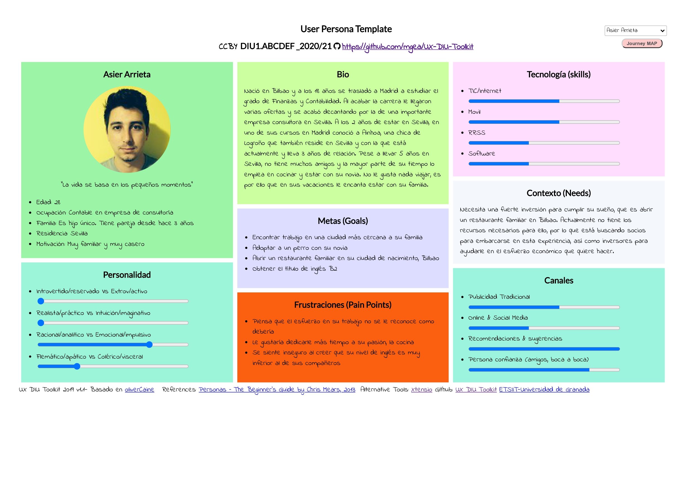
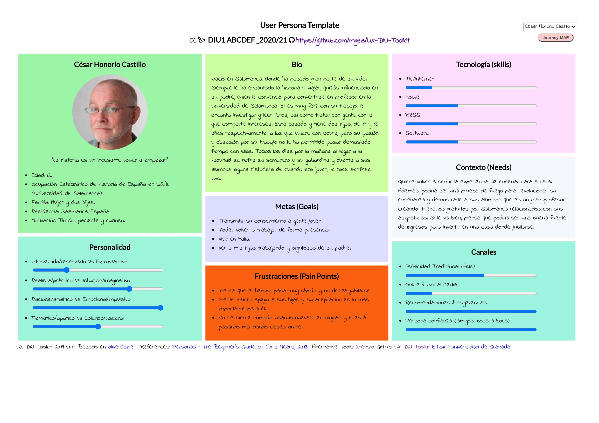
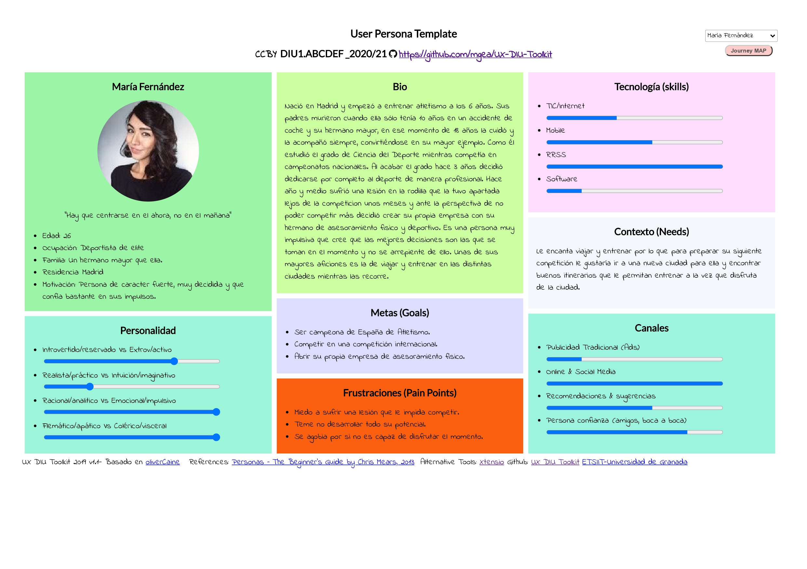

# DIU21
Prácticas Diseño Interfaces de Usuario 2020-21 (Tema: Turismo) 

Grupo: DIU1_ElReencuentro.  Curso: 2020/21

Proyecto: 
>>> EcoTravel

Descripción: 

>>> EcoTravel consiste en una aplicación que busca ofrecer una alternativa a aquellas personas que desean viajar respetando la naturaleza y descubriendo lugares y comercios rurales y que respeten la tradición, productos y lugares. Pretende crear una comunidad de usuarios y comercios/servicios que sigan estos valores y principios y conectarlos.

Logotipo: 
>>> Opcionalmente si diseña un logotipo para su producto en la práctica 3 pongalo aqui

Miembros
 * :bust_in_silhouette: Jesús González Álvarez     :octocat: [JesusGonzalezA](https://github.com/JesusGonzalezA)     
 * :bust_in_silhouette: Julio Campos Rodríguez     :octocat: [juliocamposrd](https://github.com/juliocamposrd)
 * :bust_in_silhouette: Alejandro Soriano Morante  :octocat: [Soriano00](https://github.com/Soriano00)

----- 

# Proceso de Diseño 

## Paso 1. UX Desk Research & Analisis 

 1.a Competitive Analysis
-----

>>> Hemos analizado las aplicaciones **[Passporter](https://passporterapp.com/)**, **[Tripit](https://www.tripit.com/web)**, **[Sygic Travel](https://www.sygic.com/es/travel)**, **[CheckMyTrip](https://www.checkmytrip.com/cmtweb/#/home)**. De entre ellas hemos escogido **[Passporter](https://passporterapp.com/)**, puesto que creemos que puede ser una buena solución para impulsar el turismo local.

[Más información](https://github.com/JesusGonzalezA/DIU21/tree/master/P1)

 1.b Persona
-----
>>> Seleccionamos a dos personas que quieren viajar y a otra que quiere crear viajes. Esta última, presenta dificultades con la tecnología. 

 1.c User Journey Map
----
>>> Seleccionamos estas experiencias porque son los casos de uso más habituales en esta aplicación y porque demuestran si la app cumple con su cometido.

 1.d Usability Review
----
>>>  Revisión de usabilidad:
>>> - [Enlace al documento](https://github.com/JesusGonzalezA/DIU21/tree/master/P1/Usability-review.xlsx)
>>> - Valoración final: 75
>>> - Comentario sobre la valoración: la aplicación tiene un gran rendimiento y un diseño atractivo. Sin embargo, carece de ayuda para usuarios más novatos.

## Paso 2. UX Design  

 2.a Feedback Capture Grid
----

>>> 
    
>>> El turismo como lo conocemos resulta insostenible y abandona comercios tradicionales y zonas rurales. Ofrecemos una solución que promueva el turismo sostenible, dando visibilidad a comercios locales.

 2.b ScopeCanvas
----
>>> 

 2.b Tasks analysis 
-----

>>> **User matrix:** se trata de una técnica de diseño que permite identificar las tareas más relevantes para los usuarios, así como los grupos de usuarios más críticos para el correcto funcionamiento de la solución propuesta. Se deben de enumerar en una tabla los grupos de usurios principales (columnas) y las tareas que el sistema ofrecerá (filas). Se indica la frecuencia (alta, media, baja) de uso de una tarea por un grupo de usuario en cada celda de la tabla y se indicará con un color especial las tareas/perfiles de usuarios más importantes.
>>> **Task flow:** Tras conocer los objetivos de los usuarios, se definen aquellas tareas que deben de realizar para cumplir los mismos mediante esta técnica de diseño. Permite así mostrar, de forma visual, las tareas que los usuarios quieren cumplir para conseguir sus objetivos y las relaciones que hay entre las mismas (hacer una antes de otra, para hacer x necesitas estar loggeado y haber registrado un comercio, etc). Se suelen utilizar diagramas para implementarlo.

 2.c IA: Sitemap + Labelling 
----

>>> Identificar términos para diálogo con usuario  

Término | Significado     
| ------------- | -------
  Login¿?  | acceder a plataforma

 2.d Wireframes
-----

>>> Plantear el  diseño del layout para Web/movil (organización y simulación ) 

## Paso 3. Mi UX-Case Study (diseño)

 3.a Moodboard
-----

>>> Plantear Diseño visual con una guía de estilos visual (moodboard) 
>>> Incluir Logotipo
>>> Si diseña un logotipo, explique la herramienta utilizada y la resolución empleada. ¿Puede usar esta imagen como cabecera de Twitter, por ejemplo, o necesita otra?

  3.b Landing Page
----

>>> Plantear Landing Page 

 3.c Guidelines
----

>>> Estudio de Guidelines y Patrones IU a usar 
>>> Tras documentarse, muestre las deciones tomadas sobre Patrones IU a usar para la fase siguiente de prototipado. 

  3.d Mockup
----

>>> Layout: Mockup / prototipo HTML  (que permita simular tareas con estilo de IU seleccionado)

 3.e ¿My UX-Case Study?
-----

>>> Publicar my Case Study en Github..
>>> Documente y resuma el diseño de su producto en forma de video de 90 segundos aprox

## Paso 4. Evaluación 

 4.a Caso asignado
----

>>> Breve descripción del caso asignado con enlace a  su repositorio Github

 4.b User Testing
----

>>> Seleccione 4 personas ficticias. Exprese las ideas de posibles situaciones conflictivas de esa persona en las propuestas evaluadas. Asigne dos a Caso A y 2 al caso B
 

| Usuarios | Sexo/Edad     | Ocupación   |  Exp.TIC    | Personalidad | Plataforma | TestA/B
| ------------- | -------- | ----------- | ----------- | -----------  | ---------- | ----
| User1's name  | H / 18   | Estudiante  | Media       | Introvertido | Web.       | A 
| User2's name  | H / 18   | Estudiante  | Media       | Timido       | Web        | A 
| User3's name  | M / 35   | Abogado     | Baja        | Emocional    | móvil      | B 
| User4's name  | H / 18   | Estudiante  | Media       | Racional     | Web        | B 

. 4.c Cuestionario SUS
----

>>> Usaremos el **Cuestionario SUS** para valorar la satisfacción de cada usuario con el diseño (A/B) realizado. Para ello usamos la [hoja de cálculo](https://github.com/mgea/DIU19/blob/master/Cuestionario%20SUS%20DIU.xlsx) para calcular resultados sigiendo las pautas para usar la escala SUS e interpretar los resultados
http://usabilitygeek.com/how-to-use-the-system-usability-scale-sus-to-evaluate-the-usability-of-your-website/)
Para más información, consultar aquí sobre la [metodología SUS](https://cui.unige.ch/isi/icle-wiki/_media/ipm:test-suschapt.pdf)

>>> Adjuntar captura de imagen con los resultados + Valoración personal 

 4.d Usability Report
----

>> Añadir report de usabilidad para práctica B (la de los compañeros)

>>> Valoración personal 

## Paso 5. Evaluación de Accesibilidad  

  5.a Accesibility evaluation Report 
----

>>> Indica qué pretendes evaluar (de accesibilidad) sobre qué APP y qué resultados has obtenido 

>>> 5.a) Evaluación de la Accesibilidad (con simuladores o verificación de WACG) 
>>> 5.b) Uso de simuladores de accesibilidad 

>>> (uso de tabla de datos, indicar herramientas usadas) 

>>> 5.c Breve resumen del estudio de accesibilidad (de práctica 1) y puntos fuertes y de mejora de los criterios de accesibilidad de tu diseño propuesto en Práctica 4.

## Conclusión final / Valoración de las prácticas

>>> (90-150 palabras) Opinión del proceso de desarrollo de diseño siguiendo metodología UX y valoración (positiva /negativa) de los resultados obtenidos  

