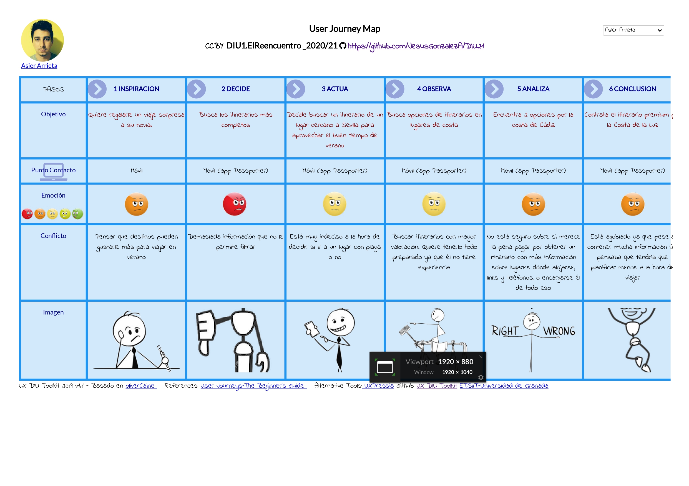
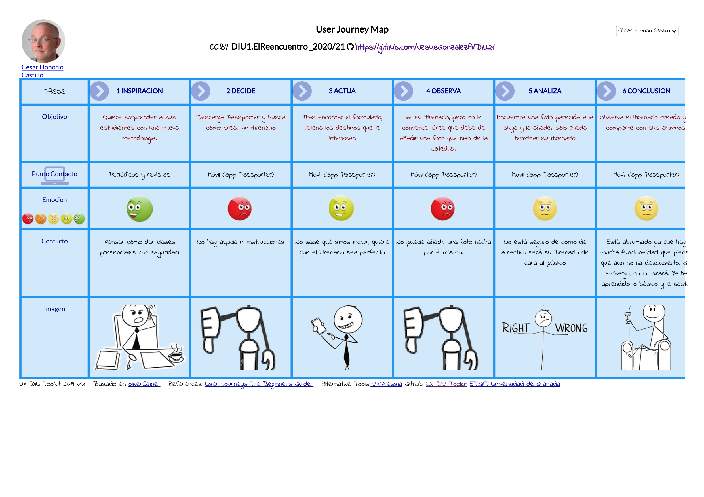
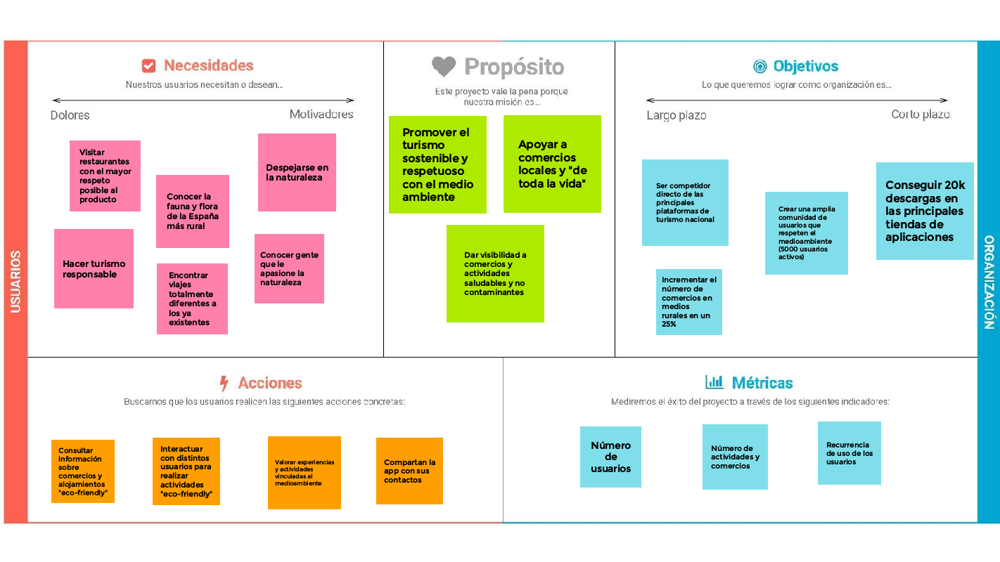

# DIU21
Prácticas Diseño Interfaces de Usuario 2020-21 (Tema: Turismo) 

Grupo: DIU1_ElReencuentro.  Curso: 2020/21

Proyecto: 
EcoTravel

Descripción: 

EcoTravel consiste en una aplicación que busca ofrecer una alternativa a aquellas personas que desean viajar respetando la naturaleza y descubriendo lugares y comercios rurales y que respeten la tradición, productos y lugares. Pretende crear una comunidad de usuarios y comercios/servicios que sigan estos valores y principios y conectarlos.

Logotipo: 

Miembros
 * :bust_in_silhouette: Jesús González Álvarez     :octocat: [JesusGonzalezA](https://github.com/JesusGonzalezA)     
 * :bust_in_silhouette: Julio Campos Rodríguez     :octocat: [juliocamposrd](https://github.com/juliocamposrd)
 * :bust_in_silhouette: Alejandro Soriano Morante  :octocat: [Soriano00](https://github.com/Soriano00)

----- 

# Proceso de Diseño 

## Paso 1. UX Desk Research & Analisis 

 1.a Competitive Analysis
-----

Hemos analizado las aplicaciones **[Passporter](https://passporterapp.com/)**, **[Tripit](https://www.tripit.com/web)**, **[Sygic Travel](https://www.sygic.com/es/travel)**, **[CheckMyTrip](https://www.checkmytrip.com/cmtweb/#/home)**. De entre ellas hemos escogido **[Passporter](https://passporterapp.com/)**, puesto que creemos que puede ser una buena solución para impulsar el turismo local.

[Más información](https://github.com/JesusGonzalezA/DIU21/tree/master/P1)

 1.b Persona
-----
Seleccionamos a dos personas que quieren viajar y a otra que quiere crear viajes. Esta última, presenta dificultades con la tecnología. 

 1.c User Journey Map
----
Seleccionamos estas experiencias porque son los casos de uso más habituales en esta aplicación y porque demuestran si la app cumple con su cometido.

 1.d Usability Review
----

- [Enlace al documento](https://github.com/JesusGonzalezA/DIU21/tree/master/P1/Usability-review.xlsx)
- Valoración final: 75
- Comentario sobre la valoración: la aplicación tiene un gran rendimiento y un diseño atractivo. Sin embargo, carece de ayuda para usuarios más novatos.

## Paso 2. UX Design  

[Más información](https://github.com/JesusGonzalezA/DIU21/tree/master/P2)

 2.a Feedback Capture Grid
----

El turismo como lo conocemos resulta insostenible y abandona comercios tradicionales y zonas rurales. Ofrecemos una solución que promueva el turismo sostenible, dando visibilidad a comercios locales.

    

 2.b ScopeCanvas
----
Nuestro proyecto (EcoTravel) consiste en una aplicación que busca ofrecer una alternativa a aquellas personas que desean viajar respetando la naturaleza y descubriendo lugares y comercios rurales y que respeten la tradición, productos y lugares. Pretende crear una comunidad de usuarios y comercios/servicios que sigan estos valores y principios y conectarlos.

 2.b Tasks analysis 
-----

**User matrix:** se trata de una técnica de diseño que permite identificar las tareas más relevantes para los usuarios, así como los grupos de usuarios más críticos para el correcto funcionamiento de la solución propuesta. Se deben de enumerar en una tabla los grupos de usurios principales (columnas) y las tareas que el sistema ofrecerá (filas). Se indica la frecuencia (alta, media, baja) de uso de una tarea por un grupo de usuario en cada celda de la tabla y se indicará con un color especial las tareas/perfiles de usuarios más importantes. \
**Task flow:** Tras conocer los objetivos de los usuarios, se definen aquellas tareas que deben de realizar para cumplir los mismos mediante esta técnica de diseño. Permite así mostrar, de forma visual, las tareas que los usuarios quieren cumplir para conseguir sus objetivos y las relaciones que hay entre las mismas (hacer una antes de otra, para hacer x necesitas estar loggeado y haber registrado un comercio, etc). Se suelen utilizar diagramas para implementarlo.

 2.c IA: Sitemap + Labelling 
----

| Label | Siginificado |
| -- | -- |
| Login | Inicio de sesión / Registro  de usuraio en la aplicación |
| EcoTravel | Página principal de la aplicación. Resumen de los posts y navegación completa |
| Búsqueda | Página de búsqueda de comercios, actividades, lugares... |
| Ajustes | Página para configurar los ajustes de la aplicación |
| Registrar nueva actividad | Página de formulario con la cual podemos añadir un nuevo comercio, una nueva actividad o nuevos productos a un comercio existente  |
| Mi perfil | Página de perfil de usuario de la aplicación. En ella el usuario será capaz de modificar y ver su perfil de la aplicación|
| Notificaciones | Página que nos muestra las últimas notificaciones que recibe un usuario |
| Resultado de búsqueda | Página que nos muestra toda la información necesaria de un comercio/actividad registrado en nuestra aplicación |
| Comercio | Página que nos muestra toda la información necesaria de un comercio registrado en nuestra aplicación |
| Actividad cultural | Página que nos muestra toda la información necesaria de una actividad cultural o excursión registrada en nuestra aplicación |
| Ubicación | Página que nos muestra los comercios y actividades que se realizan en la ubicación buscada por el usuario  |
| Producto | Página que muestra el resumen de un producto que vende el comercio. Contiene información dada por el dueño del mismo y comentarios de los usuarios acerca del mismo, si los hubiere |
| Mapa | Página externa. Mapa que muestra la ubicación del comercio |
| Post | Publicaciones realizadas por el comercio y por los usuarios sobre el mismo. |
| Contacto | Correo/Marcador de teléfono móvil propios del dispositivo |
| Galería | Página que muestra una galería de fotos subidas por el comercio y por los usuarios sobre el mismo |
| Subir imagen | Formulario para subir una nueva imagen para añadir al post |

 2.d Wireframes
-----

En el siguiente Wireframe tratamos de representar en forma de boceto la pantalla de inicio que se verá nada más acceder a la app.

A continuación se muestra el Wireframe referente a la pantalla que verá el usuario cuando quiera añadir una actividad, establecimiento, etc.

El siguiente Wireframe tratará de representar la pantalla que observa el usuario cuando selecciona una actividad para conocer más detalle sobre la misma.

Por último, con este Wireframe tratamos de presentar la pantalla con la que se encuentra un usuario cuando va a llevar a cabo una búsqueda de una actividad concreta.

## Paso 3. Mi UX-Case Study (diseño)

 3.a Moodboard
-----

Para el moodboard hemos elegido unas fotos que nos inspiraban y nos recordaban a los valores que queremos representar. Con esto hemos elegido una paleta de colores que nos permita transmitir las sensaciones que queremos que encuentren los usuarios con nosotros (ecología, calidez, transparencia, simplicidad, etc). Hemos seleccionado dos fuentes que sean muy legibles y sencillas y seleccionado unos iconos para poder crear nuestros diseños. 
Además, hemos añadido unos comentarios que muestran cómo queremos que los usuarios nos identifiquen.

[Ver más](https://github.com/JesusGonzalezA/DIU21/tree/master/P3)

### Logotipo

El logo tiene el color principal de nuestra app que representa la naturaleza. Queremos que el concepto viaje y cuidar el planeta estén presentes en todos los iconos, es por ello que hemos sustituído la letra 'o' de ecotravel por una bola del mundo y hemos añadido una maleta simbolizando el mensaje de "pensar globalmente, actuar localmente".  

#### Sin símbolos

#### B/N

#### Sólo con el nombre

#### 24x24

  3.b Landing Page
----

Puede ver [aquí](https://xd.adobe.com/view/2db3207e-db00-4f65-9419-5f6cd088a22b-78e0/?fullscreen) la landing page.
Hemos querido mostrar en portada una imagen en la que la naturaleza, la paz y lo rural destaquen y que encaje con nuestra paleta de colores. El Call To Action aparece junto con el título del proyecto y dos frases que ayudan al usuario a entender lo que hacemos y cómo lo hacemos. 
Abajo tenemos lo que podemos ofrecer a los usuarios y algunos comentarios de los mismos. Utilizamos un footer para que se pueda llegar a nuestras redes sociales fácilmente.

 3.c Guidelines
----

Hemos utilizado las guías de diseño proporcionadas por Android, debido a que la mayoría de nuestros usuarios utilizarán esta plataforma.

[Ver más](https://github.com/JesusGonzalezA/DIU21/tree/master/P3#guidelines)

[Guía de patrones de diseño](http://ui-patterns.com/)

[Guía de estilos y componentes: Material Design](https://material.io/)

### Patrones:
* [Auto-sharing](http://ui-patterns.com/patterns/auto-sharing)
* [Chat](http://ui-patterns.com/patterns/direct-messaging)
* [Testimonials](http://ui-patterns.com/patterns/testimonials)
* [Input Feedback](http://ui-patterns.com/patterns/InputFeedback)
* [Settings](http://ui-patterns.com/patterns/settings)
* [Preview](http://ui-patterns.com/patterns/LivePreview)
* [Undo](http://ui-patterns.com/patterns/undo)
* [Rate Content](http://ui-patterns.com/patterns/RateContent)
* [Notifications](http://ui-patterns.com/patterns/notifications)
* [Cards](http://ui-patterns.com/patterns/cards)
* [Continuous Scrolling](http://ui-patterns.com/patterns/ContinuousScrolling)
* [Tagging](http://ui-patterns.com/patterns/Tag)
* [Favourites](http://ui-patterns.com/patterns/favorites)

### Componentes:
* [App bar: top](https://material.io/components/app-bars-top)
* [Bottom navigation](https://material.io/components/bottom-navigation)
* [Card](https://material.io/components/cards)
* [Lists](https://material.io/components/lists) 
* Formularios:
    * [Checkboxes](https://material.io/components/date-pickers)
    * [Switches](https://material.io/components/switches)
    * [Text fields](https://material.io/components/text-fields)
* [Chips](https://material.io/components/chips)
* [Divider](https://material.io/components/dividers)

  3.d Mockup
----

[Ver más](https://github.com/JesusGonzalezA/DIU21/tree/master/P3#mockup-layout-hi-fi)

Puede ver [aquí](https://xd.adobe.com/view/33c4e3f8-e569-449f-adc6-9f347606e847-6697/?fullscreen) la presentación del diseño.

 3.e ¿My UX-Case Study?
-----

Para ver el caso de estudio publicado pinche [aquí](https://youtu.be/_eJTgeZffRU)

## Paso 4. Evaluación 

 4.a Caso asignado
----

>>> Breve descripción del caso asignado con enlace a  su repositorio Github

 4.b User Testing
----

>>> Seleccione 4 personas ficticias. Exprese las ideas de posibles situaciones conflictivas de esa persona en las propuestas evaluadas. Asigne dos a Caso A y 2 al caso B
 

| Usuarios | Sexo/Edad     | Ocupación   |  Exp.TIC    | Personalidad | Plataforma | TestA/B
| ------------- | -------- | ----------- | ----------- | -----------  | ---------- | ----
| User1's name  | H / 18   | Estudiante  | Media       | Introvertido | Web.       | A 
| User2's name  | H / 18   | Estudiante  | Media       | Timido       | Web        | A 
| User3's name  | M / 35   | Abogado     | Baja        | Emocional    | móvil      | B 
| User4's name  | H / 18   | Estudiante  | Media       | Racional     | Web        | B 

. 4.c Cuestionario SUS
----

>>> Usaremos el **Cuestionario SUS** para valorar la satisfacción de cada usuario con el diseño (A/B) realizado. Para ello usamos la [hoja de cálculo](https://github.com/mgea/DIU19/blob/master/Cuestionario%20SUS%20DIU.xlsx) para calcular resultados sigiendo las pautas para usar la escala SUS e interpretar los resultados
http://usabilitygeek.com/how-to-use-the-system-usability-scale-sus-to-evaluate-the-usability-of-your-website/)
Para más información, consultar aquí sobre la [metodología SUS](https://cui.unige.ch/isi/icle-wiki/_media/ipm:test-suschapt.pdf)

>>> Adjuntar captura de imagen con los resultados + Valoración personal 

 4.d Usability Report
----

>> Añadir report de usabilidad para práctica B (la de los compañeros)

>>> Valoración personal 

## Paso 5. Evaluación de Accesibilidad  

  5.a Accesibility evaluation Report 
----

>>> Indica qué pretendes evaluar (de accesibilidad) sobre qué APP y qué resultados has obtenido 

>>> 5.a) Evaluación de la Accesibilidad (con simuladores o verificación de WACG) 
>>> 5.b) Uso de simuladores de accesibilidad 

>>> (uso de tabla de datos, indicar herramientas usadas) 

>>> 5.c Breve resumen del estudio de accesibilidad (de práctica 1) y puntos fuertes y de mejora de los criterios de accesibilidad de tu diseño propuesto en Práctica 4.

## Conclusión final / Valoración de las prácticas

>>> (90-150 palabras) Opinión del proceso de desarrollo de diseño siguiendo metodología UX y valoración (positiva /negativa) de los resultados obtenidos  

