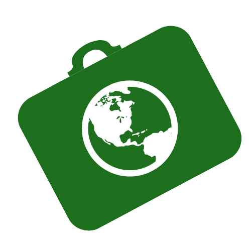

# DIU21
Prácticas Diseño Interfaces de Usuario 2020-21 (Tema: Turismo) 

Grupo: DIU1_ElReencuentro.  Curso: 2020/21

Proyecto: 
EcoTravel

Descripción: 

EcoTravel consiste en una aplicación que busca ofrecer una alternativa a aquellas personas que desean viajar respetando la naturaleza y descubriendo lugares y comercios rurales y que respeten la tradición, productos y lugares. Pretende crear una comunidad de usuarios y comercios/servicios que sigan estos valores y principios y conectarlos.

Logotipo: 

Miembros
 * :bust_in_silhouette: Jesús González Álvarez     :octocat: [JesusGonzalezA](https://github.com/JesusGonzalezA)     
 * :bust_in_silhouette: Julio Campos Rodríguez     :octocat: [juliocamposrd](https://github.com/juliocamposrd)
 * :bust_in_silhouette: Alejandro Soriano Morante  :octocat: [Soriano00](https://github.com/Soriano00)

----- 

# Proceso de Diseño 

## Paso 1. UX Desk Research & Analisis 

En esta etapa hemos realizado un análisis de aplicaciones relacionadas con la planificación de viajes. Hemos analizado en profundidad [Passporter](https://passporterapp.com/) y cómo unas personas ficticias la utilizarían.
[Más información](https://github.com/JesusGonzalezA/DIU21/tree/master/P1)

 1.a Competitive Analysis
-----

Hemos analizado las aplicaciones **[Passporter](https://passporterapp.com/)**, **[Tripit](https://www.tripit.com/web)**, **[Sygic Travel](https://www.sygic.com/es/travel)**, **[CheckMyTrip](https://www.checkmytrip.com/cmtweb/#/home)**. De entre ellas hemos escogido **[Passporter](https://passporterapp.com/)**, puesto que creemos que puede ser una buena solución para impulsar el turismo local.

 1.b Persona
-----
Hemos seleccionado tres personas para poder abarcar todos los tipos de usuarios que utilizarían la aplicación [Passporter](https://passporterapp.com/).

Asier es un joven no muy interesado en viajar y su sueño es abrir un restaurante en su ciudad de origen, Bilbao. 

[Ver más](https://github.com/JesusGonzalezA/DIU21/tree/master/P1#asier-arrieta)

César es un profesor de historia al que el COVID le ha afectado mucho, debido a que no sabe cómo actualizar su metodología docente. Passporter podría ser una opción para crear itinerario para mostrar a sus alumnos.

[Ver más](https://github.com/JesusGonzalezA/DIU21/tree/master/P1#c%C3%A9sar-honorio)

María es una joven deportista de fuerte carácter a la que le gusta entrenar en las ciudades a las que viaja. Su objetivo es llegar a convertirse en deportista de élite.

[Ver más](https://github.com/JesusGonzalezA/DIU21/tree/master/P1#mar%C3%ADa-fern%C3%A1ndez)

 1.c User Journey Map
----
Gracias al User Journey Map podemos valorar cómo se siente el usuario utilizando la aplicación en casos de uso habituales.

Asier quiere adquirir un itinerario para regalárselo a su novia.

[Ver más](https://github.com/JesusGonzalezA/DIU21/blob/master/P1/Images/Journey1.jpg)

César quiere crear un itinerario para mostrárselo a sus alumnos.

[Ver más](https://github.com/JesusGonzalezA/DIU21/blob/master/P1/Images/Journey2.jpg)

María quiere obtener un itinerario para ir a entrenar.

[Ver más](https://github.com/JesusGonzalezA/DIU21/blob/master/P1/Images/Journey3.jpg)

 1.d Usability Review
----

- Valoración final: 75
- Comentario sobre la valoración: la aplicación tiene un gran rendimiento y un diseño atractivo. Sin embargo, carece de ayuda para usuarios más novatos. Los usuarios deben de ser capaces de utilizar la aplicación con relativa facilidad para la mayoría de tareas fundamentales. Sin embargo, tareas como la búsqueda, filtros y previsualizar actividades resultan mal desarrolladas.

Puede ver más información [aquí](https://github.com/JesusGonzalezA/DIU21/tree/master/P1/Usability-review.xlsx).

## Paso 2. UX Design  

En esta etapa hemos recogido los puntos fuertes y débiles de [Passporter](https://passporterapp.com/). Además, hemos creado una nueva solución para fomentar el turismo local, EcoTravel.
[Más información](https://github.com/JesusGonzalezA/DIU21/tree/master/P2)

 2.a Malla receptora de información
----

El turismo como lo conocemos resulta insostenible y abandona comercios tradicionales y zonas rurales. Ofrecemos una solución que promueva el turismo sostenible, dando visibilidad a comercios locales.

    

 2.b ScopeCanvas
----
Nuestro proyecto (EcoTravel) consiste en una aplicación que busca ofrecer una alternativa a aquellas personas que desean viajar respetando la naturaleza y descubriendo lugares y comercios rurales y que respeten la tradición, productos y lugares. Pretende crear una comunidad de usuarios y comercios/servicios que sigan estos valores y principios y conectarlos.

 2.b Tasks analysis 
-----

**User matrix:** se trata de una técnica de diseño que permite identificar las tareas más relevantes para los usuarios, así como los grupos de usuarios más críticos para el correcto funcionamiento de la solución propuesta. Se deben de enumerar en una tabla los grupos de usurios principales (columnas) y las tareas que el sistema ofrecerá (filas). Se indica la frecuencia (alta, media, baja) de uso de una tarea por un grupo de usuario en cada celda de la tabla y se indicará con un color especial las tareas/perfiles de usuarios más importantes. \
**Task flow:** Tras conocer los objetivos de los usuarios, se definen aquellas tareas que deben de realizar para cumplir los mismos mediante esta técnica de diseño. Permite así mostrar, de forma visual, las tareas que los usuarios quieren cumplir para conseguir sus objetivos y las relaciones que hay entre las mismas (hacer una antes de otra, para hacer x necesitas estar loggeado y haber registrado un comercio, etc). Se suelen utilizar diagramas para implementarlo.

 2.c Arquitectura de información: Sitemap + Labelling 
----

| Label | Siginificado |
| -- | -- |
| Login | Inicio de sesión / Registro  de usuraio en la aplicación |
| EcoTravel | Página principal de la aplicación. Resumen de los posts y navegación completa |
| Búsqueda | Página de búsqueda de comercios, actividades, lugares... |
| Ajustes | Página para configurar los ajustes de la aplicación |
| Registrar nueva actividad | Página de formulario con la cual podemos añadir un nuevo comercio, una nueva actividad o nuevos productos a un comercio existente  |
| Mi perfil | Página de perfil de usuario de la aplicación. En ella el usuario será capaz de modificar y ver su perfil de la aplicación|
| Notificaciones | Página que nos muestra las últimas notificaciones que recibe un usuario |
| Resultado de búsqueda | Página que nos muestra toda la información necesaria de un comercio/actividad registrado en nuestra aplicación |
| Comercio | Página que nos muestra toda la información necesaria de un comercio registrado en nuestra aplicación |
| Actividad cultural | Página que nos muestra toda la información necesaria de una actividad cultural o excursión registrada en nuestra aplicación |
| Ubicación | Página que nos muestra los comercios y actividades que se realizan en la ubicación buscada por el usuario  |
| Producto | Página que muestra el resumen de un producto que vende el comercio. Contiene información dada por el dueño del mismo y comentarios de los usuarios acerca del mismo, si los hubiere |
| Mapa | Página externa. Mapa que muestra la ubicación del comercio |
| Post | Publicaciones realizadas por el comercio y por los usuarios sobre el mismo. |
| Contacto | Correo/Marcador de teléfono móvil propios del dispositivo |
| Galería | Página que muestra una galería de fotos subidas por el comercio y por los usuarios sobre el mismo |
| Subir imagen | Formulario para subir una nueva imagen para añadir al post |

 2.d Wireframes
-----

En el siguiente Wireframe tratamos de representar en forma de boceto la pantalla de inicio que se verá nada más acceder a la app.

A continuación se muestra el Wireframe referente a la pantalla que verá el usuario cuando quiera añadir una actividad, establecimiento, etc.

El siguiente Wireframe tratará de representar la pantalla que observa el usuario cuando selecciona una actividad para conocer más detalle sobre la misma.

Por último, con este Wireframe tratamos de presentar la pantalla con la que se encuentra un usuario cuando va a llevar a cabo una búsqueda de una actividad concreta.

## Paso 3. Mi UX-Case Study (diseño)

En esta etapa hemos diseñado la solución analizada anteriormente. Así, hemos creado un logo, una paleta de colores, una landing page para promocionar a la marca EcoTravel y hemos realizado un diseño de alta fidelidad de la aplicación móvil. [Más información](https://github.com/JesusGonzalezA/DIU21/tree/master/P3)

 3.a Moodboard
-----

Para el moodboard hemos elegido unas fotos que nos inspiraban y nos recordaban a los valores que queremos representar. Con esto hemos elegido una paleta de colores que nos permita transmitir las sensaciones que queremos que encuentren los usuarios con nosotros (ecología, calidez, transparencia, simplicidad, etc). Hemos seleccionado dos fuentes que sean muy legibles y sencillas y seleccionado unos iconos para poder crear nuestros diseños. 
Además, hemos añadido unos comentarios que muestran cómo queremos que los usuarios nos identifiquen.

[Ver más](https://github.com/JesusGonzalezA/DIU21/tree/master/P3)

### Logotipo

El logo tiene el color principal de nuestra app que representa la naturaleza. Queremos que el concepto viaje y cuidar el planeta estén presentes en todos los iconos, es por ello que hemos sustituído la letra 'o' de ecotravel por una bola del mundo y hemos añadido una maleta simbolizando el mensaje de "pensar globalmente, actuar localmente".  

#### Sin símbolos

#### B/N

#### Sólo con el nombre

#### 24x24

  3.b Landing Page
----

Puede ver [aquí](https://xd.adobe.com/view/2db3207e-db00-4f65-9419-5f6cd088a22b-78e0/?fullscreen) la landing page.
Hemos querido mostrar en portada una imagen en la que la naturaleza, la paz y lo rural destaquen y que encaje con nuestra paleta de colores. El Call To Action aparece junto con el título del proyecto y dos frases que ayudan al usuario a entender lo que hacemos y cómo lo hacemos. 
Abajo tenemos lo que podemos ofrecer a los usuarios y algunos comentarios de los mismos. Utilizamos un footer para que se pueda llegar a nuestras redes sociales fácilmente.

 3.c Guidelines
----

[Ver más](https://github.com/JesusGonzalezA/DIU21/tree/master/P3#guidelines)

Hemos utilizado las guías de diseño proporcionadas por [Android](https://material.io/), debido a que la mayoría de nuestros usuarios utilizarán esta plataforma.

### Patrones utilizados:
* [Auto-sharing](http://ui-patterns.com/patterns/auto-sharing)
* [Chat](http://ui-patterns.com/patterns/direct-messaging)
* [Testimonials](http://ui-patterns.com/patterns/testimonials)
* [Input Feedback](http://ui-patterns.com/patterns/InputFeedback)
* [Settings](http://ui-patterns.com/patterns/settings)
* [Preview](http://ui-patterns.com/patterns/LivePreview)
* [Undo](http://ui-patterns.com/patterns/undo)
* [Rate Content](http://ui-patterns.com/patterns/RateContent)
* [Notifications](http://ui-patterns.com/patterns/notifications)
* [Cards](http://ui-patterns.com/patterns/cards)
* [Continuous Scrolling](http://ui-patterns.com/patterns/ContinuousScrolling)
* [Tagging](http://ui-patterns.com/patterns/Tag)
* [Favourites](http://ui-patterns.com/patterns/favorites)

### Componentes utilizados:
* [App bar: top](https://material.io/components/app-bars-top)
* [Bottom navigation](https://material.io/components/bottom-navigation)
* [Card](https://material.io/components/cards)
* [Lists](https://material.io/components/lists) 
* Formularios:
    * [Checkboxes](https://material.io/components/date-pickers)
    * [Switches](https://material.io/components/switches)
    * [Text fields](https://material.io/components/text-fields)
* [Chips](https://material.io/components/chips)
* [Divider](https://material.io/components/dividers)

  3.d Mockup
----

[Ver más](https://github.com/JesusGonzalezA/DIU21/tree/master/P3#mockup-layout-hi-fi)

Se han elaborado las pantallas principales que permiten ver cómo se interactuaría con la app:
- Home
- Buscar
- Detalle de una experiencia
- Crear una experiencia

Con ellas podemos mostrar los casos de uso:
- Ver las actividades guardadas por el usuario
- Añadir una experiencia nueva
- Buscar una experiencia y filtrarla
- Ver la información de una experiencia

Puede ver [aquí](https://xd.adobe.com/view/33c4e3f8-e569-449f-adc6-9f347606e847-6697/?fullscreen) la presentación del diseño.

 3.e ¿My UX-Case Study?
-----

Hemos realizado un vídeo en el que explicamos nuestro caso de estudio: EcoTravel.
Para verlo pulse [aquí](https://youtu.be/_eJTgeZffRU)

## Paso 4. Evaluación 

Ver la evaluación completa [aquí](https://github.com/JesusGonzalezA/DIU21/tree/master/P4)
 4.a Caso asignado
----

El proyecto a evaluar es [GeoLAND](https://github.com/gonzalodelatorree/DIU21).

Según sus desarrolladores, se trata de una "aplicación desarrollada para que los usuarios puedan gestionar y planificar su visita a la provincia de Granada y Andalucía y así conseguir incentivar el turismo rural y local".

 4.b User Testing
----

En vez de utilizar usuarios ficticios, hemos difundido nuestros cuestionarios selectivamente y hemos listado la información recogida [aquí](https://github.com/JesusGonzalezA/DIU21/blob/master/P4/Docs/Usuarios.pdf)

. 4.c Cuestionario SUS
----

Para más información, consultar aquí sobre la [metodología SUS](https://cui.unige.ch/isi/icle-wiki/_media/ipm:test-suschapt.pdf)

**Puntuación A ([EcoTravel](https://github.com/jesusgonzaleza/DIU21)):** 87.03125
**Puntuación B ([GeoLAND](https://github.com/gonzalodelatorree/DIU21)):** 69.54545

Se considera que aquellas aplicaciones con una puntuación en un test SUS superior a 68 han recibido una buena acogida por parte de los usuarios pero podría mejorar. Una puntuación superior a 80 significa que los usuarios aman la app y que existe una alta posibilidad de que sea recomendada entre usuarios.
Como se puede observar, aunque [EcoTravel](https://github.com/jesusgonzaleza/DIU21) arroja mejores resultados en los cuestionarios realizados que [GeoLAND](https://github.com/gonzalodelatorree/DIU21), ambos han recibido una buena valoración.

Ver [aquí](https://github.com/JesusGonzalezA/DIU21/tree/master/P4#A/B-Testing) el informe completo

 4.d Usability Report
----

Vea toda la información [aquí](https://github.com/JesusGonzalezA/DIU21/blob/master/P4/Docs/usability_report.pdf)

**Análisis SUS:** podemos analizar que la aplicación GeoLAND genera una impresión buena, debido a que los usuarios no han encontrado problemas serios utilizando el prototipo de la aplicación. Sin embargo, según los datos que nos brinda el cuestionario no llega a ser lo suficientemente atractiva y se debería pulir algunos aspectos de diseño y usabilidad para que la experiencia de usuario se vea potenciada.

**Valoración personal:** cabe destacar la labor que ha realizado el grupo, elaborando múltiples pantallas que han transmitido muy bien la idea de negocio. Nos ha permitido conocer viendo pocas pantallas del prototipo lo que quieren conseguir con la app y qué funcionalidades pretenden ofrecer. 

## Conclusión final / Valoración de las prácticas

En general, las prácticas de esta asignatura nos han aportado mucho. Hemos aprendido a elaborar un diseño a partir de una idea de negocio centrándonos en los usuarios a los que queríamos enfocar la misma. Además, hemos descubierto la importancia de realizar esta fase de diseño antes de implementar y pensar en todo tipo de usuarios y dispositivos, centrándonos en usabilidad y accesibilidad.

Finalmente, el modelo de trabajo de las prácticas nos ha gustado mucho porque hemos potenciado algunas competencias esenciales como el trabajo en equipo, la proactividad y la comunicación. 

